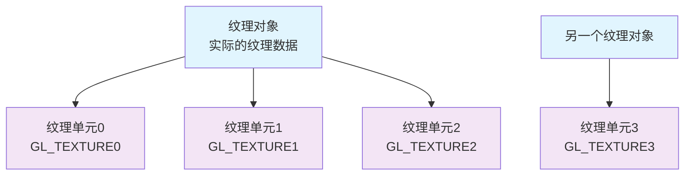
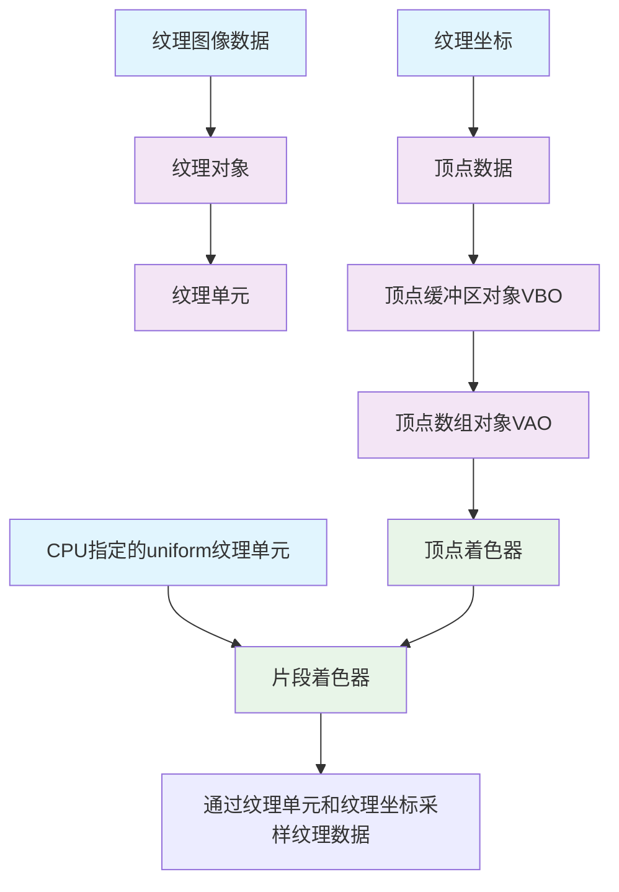

## CPU中的纹理数据
纹理数据存储在CPU中，通过`stbi_load`函数加载。
随后通过`glTexImage2D`函数传入给GPU的纹理对象中，之后可以通过`stbi_image_free`释放掉cpu的数据。


## 纹理对象
显存中存储实际纹理数据的容器，内容包含：
1. 像素数据：通过`glTexImage2D`函数传入
2. 可能的多个mipmap层级：通过`glGenerateMipmap`函数生成
1. 纹理参数：通过`glTexParameteri`函数设置
2. 纹理元数据（尺寸、格式等）

**生命周期**：通过 `glGenTextures` 创建，`glDeleteTextures` 删除

## 纹理目标
告诉OpenGL如何解释纹理数据，片段着色器中的采样器类型必须与纹理目标匹配（如 sampler2D 对应 GL_TEXTURE_2D）
`glBindTexture(GL_TEXTURE_2D, texture1);`

**类型：**
GL_TEXTURE_1D - 一维纹理
GL_TEXTURE_2D - 二维纹理（最常用）
GL_TEXTURE_3D - 三维纹理
GL_TEXTURE_CUBE_MAP - 立方体贴图
GL_TEXTURE_1D_ARRAY - 一维纹理数组
GL_TEXTURE_2D_ARRAY - 二维纹理数组
GL_TEXTURE_CUBE_MAP_ARRAY - 立方体贴图数组
GL_TEXTURE_2D_MULTISAMPLE - 多重采样二维纹理
GL_TEXTURE_2D_MULTISAMPLE_ARRAY - 多重采样二维纹理数组
GL_TEXTURE_BUFFER - 缓冲纹理


## 纹理单元
纹理单元是是GPU中的特殊寄存器/状态机，**着色器通过纹理单元访问纹理对象**。

OpenGL提供多个纹理单元（GL_TEXTURE0, GL_TEXTURE1, ...）

使用`glActiveTexture`函数可以激活特定单元，**并使用`glBindTexture`函数将纹理对象绑定到该单元。** 。在cpu程序中，设置shader中`glUniform1i(glGetUniformLocation(shader0.ID, "texture0"), 0)`就是将shader0中的texture0变量绑定到纹理单元0

## 纹理采样器
片段着色器中，纹理采样器用于从纹理对象中获取纹理数据。
类型：`sampler2D`

使用例：
```c++
// cpu program
glActiveTexture(GL_TEXTURE0); // 激活纹理单元0
glBindTexture(GL_TEXTURE_2D, texture0); // 绑定纹理对象texture0到纹理单元0
glUniform1i(glGetUniformLocation(shader0.ID, "texture0"), 0); // 设置shader0中的texture0变量绑定到纹理单元0,

// fragment shader
uniform sampler2D texture0; // 片段着色器中的纹理采样器
texture2D(texture0, TexCoord)// 获取纹理单元中TexCoord处的纹理对象的纹理数据，其中TexCoord是从cpu->vert->frag传入的纹理坐标并在frag中自动插值出片元纹理坐标
```

**纹理单元和纹理对象的关系**如下：


## 纹理使用示意图

右半：纹理坐标传入片段着色器流程
左上：着色器中访问纹理对象通过纹理采样器（其值为纹理单元索引，cpu程序中指定）
左下：纹理数据被纹理对象存储，纹理对象被绑定到纹理单元

