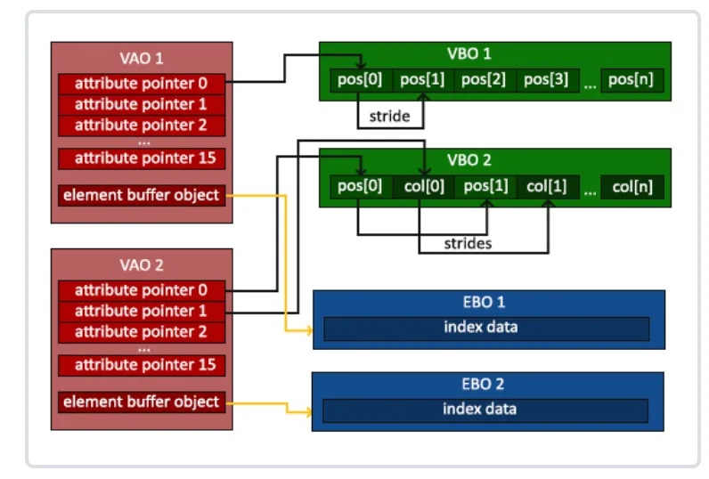

# VAO/VBO/EBO

**VBO（Vertex Buffer Object）**
本质：一块**显存**里的线性缓冲区（GL_ARRAY_BUFFER）。
存放：顶点属性（位置、法线、UV、颜色……）。
生命周期：
glGenBuffers → glBufferData 真正把数据拷进显存 → 以后可被多个 VAO 引用。
在 GPU 里：就是一块普通的显存，没有“格式”概念，只有字节。
用法：
```c++
glBindBuffer(GL_ARRAY_BUFFER, vbo);
glVertexAttribPointer(0, 3, GL_FLOAT, …, 0);  // 告诉 GPU 怎么解读这块显存
```
**EBO（Element Buffer Object）**
本质：同一块**显存**，只是绑定目标变成 GL_ELEMENT_ARRAY_BUFFER。
存放：索引（GLushort/GLuint）。
在 GPU 里：仍然是普通显存，只不过 draw call 时 GPU 的索引单元会从这里读下标。
可以被多个 VAO 共享；但一个 VAO 同一时间只能绑定一个 EBO。

**VAO（Vertex Array Object）**
本质：CPU 端的“状态快照”，记录下面一堆信息：
- 每个属性从哪个 VBO 拉数据（stride、offset、type、normalize、divisor…）
- 当前绑定的 EBO 是哪个
- 哪些属性启用了（glEnableVertexAttribArray）

不占用 GPU 显存（驱动里可能有小块系统内存存描述符，但对用户透明）。
绑定 VAO 时，OpenGL 一次性把上述状态全部恢复，省去了很多 glBindBuffer + glVertexAttribPointer 调用。
在 GPU 侧没有任何“VAO 内存”，它只是告诉 GPU“接下来用哪块 VBO/EBO、怎么解析”。

---

**一张图总结**
CPU 端：
VAO ──引用──▶ VBO 句柄
│
└─引用──▶ EBO 句柄

GPU 端：
显存里只有真正的 buffer 数据（VBO、EBO），没有“VAO 实体”。
GPU 根据 VAO 里记录的状态去显存取顶点、索引，然后送流水线。

