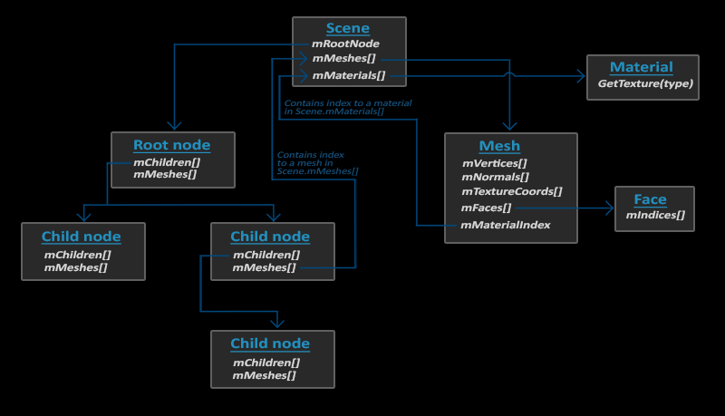

# TODO
- [ ] 使用父子网格数据结构存储Mesh 
- [ ] 读取fbx文件

# Assimp
## Assimp数据结构

## 导入
 Assimp::Importer importer;
    const aiScene *scene = importer.ReadFile(path, aiProcess_Triangulate | aiProcess_FlipUVs); 

导入选项：
`aiProcess_Triangulate`: 告诉Assimp，如果模型不是（全部）由三角形组成，它需要将模型所有的图元形状变换为三角形。
`aiProcess_FlipUVs`: 加载图像时，翻转y轴(OpenGL的t从底端向上增大，图像一般上方为t=0)
`aiProcess_GenNormals`：如果模型不包含法向量的话，就为每个顶点创建法线。
`aiProcess_SplitLargeMeshes`：将比较大的网格分割成更小的子网格，如果你的渲染有最大顶点数限制，只能渲染较小的网格，那么它会非常有用。
`aiProcess_OptimizeMeshes`：和上个选项相反，它会将多个小网格拼接为一个大的网格，减少绘制调用从而进行优化。

# 自定义数据结构
Model
    Mesh
        Vertex
        Texture

# 其他
aiProcess_FlipUVs: 翻转mTextureCoords中的v坐标为1-v
stbi_set_flip_vertically_on_load: 翻转实际的data数据data[y] = data[height - y]